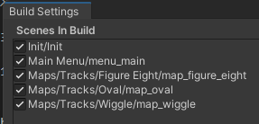

# Kario Mart
> Author: Joakim Linna GP23 (MAL)
>
> Unity Version: 2022.3.8f1

## Instructions
This repository will be public only for reasons of grading. Once the grading has been completed the project will be set to private.

The project is confirmed buildable using Mono or il2cpp on windows. Do so if you wish, or use the package that includes prebuilt (il2cpp) binaries for windows.

### Playing
Easiest way to play is to run the prebuilt binary. If you would rather play in editor, open the Init or menu_main scenes and start playmode.

#### Keymap
Steering is relative to car direction.
- System
    - Escape - Toggle pause menu (only in race session)
- Time Trial
    - W/S - accelerate/brake
    - A/D - steer
- PvP
    - Player 1
        - W/S - Accelerate/Brake
        - A/D - Steer
        - Left Shift - Use powerup
    - Player 2
        - Up/Down arrows - Accelerate/Brake
        - Left/Right arrows - Steer
        - Right Control - Use powerup

## Runtime scenes
Since I divided my folder structure into modules, there are a lot of scenes in the project to be able to separate development. The ones represented in the build settings below (library is git-ignored so it isnt pushed to github) are the ones i consider relevant to look at.

### Init
Simply contains a SceneLoader and loads the main menu scene. This is technically an artefact from me attempting to use the addressables package to take advantage of its scene loading capabilities. Due to an issue with addressables throwing exceptions and messing up asset loading, the final version does not use addressables.

### menu_main
A main menu that dynamically adds maps and gamemodes depending on how many are available. Any combination of map/gamemode works.

> When the play button is pressed, the sceneloader loads the selected map and instantiates a GamemodeManager with the selected Gamemode.

### Tracks/"map_*"
The maps contain a mapmanager, it defines a lot of properties about the active map.

Apart from that, maps are designed to be static and not change much during runtime. The exception for this is that the TimeTrial gamemode disables powerups through the mapmanager (to lower the influence of luck).

## Important dev scenes

### Gamemodes
These are available to play with through the Gamemodes scene. If you want to try this: disable the gamemode manager, enable the gamemode object you are interested in, drag any track into the hierarchy (so that it is additively loaded in editor) and start playmode. Cars will be spawned on start.

Gamemodes are loaded on runtime as prefabs, not as scenes, as everything could be packed into single hierarchies without making a mess. This scene was only used for development.

# Mechanics
Below are the most important mechanics described on a high level. Any relevant details about implementation are highlighted.

The main concept for the system design was to split up and modularize the scripts as much as reasonably possible. UI is mostly implemented as Observers, and all scripts are written with as strict adherance to the single responsibility principle as possible. Due to the time restrictions (and some unity jank) this requirement is unfortunately not fully global, but that was at least the concept.

## Car
The car itself only knows about itself and what it's supposed to do. Handle throttle, steering, braking, and whether it's gone through a checkpoint.

### Player Car
A variant of Car that has input and a powerup inventory. Uses the new input system.

## Session Managers
### Map Manager
Responsible for map data. One is included in each track scene. Holds checkpoints, startgrid, and powerup box references. Also responsible for loading laptime leaderboards.
### Gamemode Manager
Responsible for spawning the gamemode, whichever one has been selected. Flow manager more than anything (including pausing and ending a session prematurely).

## Gamemode
Gamemode is a base class that defines functions all gamemodes should have such as starting/ending races and spawning players.

### Time Trial
Singleplayer gamemode that keeps track of the current laptime and the session best laptime. Includes UI that shows the player the session state, and allows saving of session best laptime at end of session.

> To reach the leaderboard section, press the "End Session" button in the pause menu. (This is obviously not optimal for UX.)

### PvP
Handles multiple players and their race positions. Prefab includes pvp ui such as what lap/checkpoint combo the players have.

## Powerups
All powerups inherit from the same base; but are split into either Applied or Spawned. Spawned powerups simply add functionality.
> E.g. Powerups have an effect time; spawned powerups additionally have a lifetime for their spawned gameobject.

### Turbo (applied)
Adds speed and lowers drag of the target car for a few seconds.

### Sawblade (spawned)
Removes any drag from a car to simulate a puncture and loss of traction.

### Oil splat (spawned)
Slows the car by disabling acceleration. (no this doesnt make sense, it was added last and the effect type was unique)

## Leaderboards
Use JsonUtility to store player data.
### Util/Pathbuilder
Used to interface with the unity path in a cleaner way. Probably my favorite script in the entire project.

## Other
There are A LOT of scripts. Since they are divided into namespaces consistent with the folder structure it should (hopefully) be easy to navigate. 

### UI
Most of the UI scripts are less robust than the rest. I dislike working with unity UI and this is definitely reflected in my code. I apologize in advance..
They do however as previously stated attempt to let game function objects just handle the game state; and not impede performance too much.

# Sources
I didnt use anything for inspiration, but I did use some sources as reference for file reading as this is something that keeps escaping my mind. These are listed below.

### [Read files](https://www.c-sharpcorner.com/UploadFile/mahesh/how-to-read-a-text-file-in-C-Sharp/)

### [Write files](https://www.c-sharpcorner.com/article/c-sharp-write-to-file/)